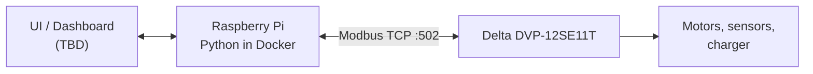

# Solar Panel Cleaning Robot — IoT Gateway

**[ภาษาไทย](#ภาษาไทย) | [English](#english)**

---

## ภาษาไทย

### เกี่ยวกับโปรเจกต์

โครงงานวิศวกรรมหุ่นยนต์ (ปริญญาตรี) มจพ.
**"Development of an IoT-Based Control, Monitoring, and Self-Charging System for a Solar Panel Cleaning Robot"**
(การพัฒนาระบบควบคุม ติดตาม และชาร์จพลังงานอัตโนมัติผ่าน IoT สำหรับหุ่นยนต์ทำความสะอาดแผงโซลาร์เซลล์)

หุ่นยนต์ถูกควบคุมด้วย PLC Delta DVP-12SE11T ส่วนนี้พัฒนาเสร็จแล้ว
Repository นี้คือ **IoT Gateway** บน Raspberry Pi ที่ทำหน้าที่อ่านสถานะและสั่งงาน PLC ผ่าน Modbus TCP

### ภาพรวมระบบ


- **PLC** รับผิดชอบ logic การเคลื่อนที่, interlock และความปลอดภัยทั้งหมด
- **Pi** ทำหน้าที่อ่านข้อมูลและส่ง "คำขอ" (request bit) เท่านั้น ladder ใน PLC เป็นตัวตัดสินใจว่าจะทำตามหรือไม่
- Pi คุยกับ PLC โดยตรงผ่าน Modbus TCP ไม่ใช้ MQTT

### ความสามารถ (เป้าหมาย)

- ควบคุม: Start / Stop / เลือก Mode
- ติดตาม: สถานะหุ่นยนต์, ตำแหน่ง/limit switch, alarm
- แบตเตอรี่และการชาร์จเอง: แรงดัน, กระแส, %, สถานะการชาร์จ
- ตั้งเวลาทำความสะอาด และบันทึกประวัติ

### ความคืบหน้า

| ขั้น | งาน | สถานะ |
|---|---|---|
| 1 | Config + tag map + แปลง address ของ Delta | เสร็จ |
| 2 | PLC จำลอง (Mock) | เสร็จ (datastore, TCP server, จำลองการทำงานหุ่น) |
| 3 | Client อ่านค่า (read-only) | เสร็จ |
| 4 | Polling + logging | เสร็จ (SQLite) |
| 5 | คำสั่ง Start/Stop/Return/Reset | เสร็จ |
| 6 | แบตเตอรี่ / การชาร์จ | เสร็จ (Tuya + heartbeat) |
| 7 | ตั้งเวลา | ยังไม่เริ่ม |
| 8 | UI / API | ยังไม่เริ่ม |

### โครงสร้างไฟล์

```
app/
  config.py        อ่านค่าตั้งค่าจาก .env
  delta.py         แปลงชื่อ device ของ Delta (X/Y/M/D) เป็น Modbus address
  tags.py          โหลดและตรวจสอบ tag map
  __main__.py      จุดเริ่มโปรแกรม (python -m app)
config/
  plc_tags.yaml    tag map: ชื่อ -> device ใน PLC
tests/             unit tests
.env.example       ตัวอย่างค่าตั้งค่า (คัดลอกเป็น .env)
Dockerfile, docker-compose.yml
```

### การตั้งค่า

ค่าคงที่ทั้งหมดอยู่นอกโค้ด:

| ไฟล์ | commit ขึ้น git | เก็บอะไร |
|---|---|---|
| `.env` | **ไม่** | IP/port/unit ID ของ PLC, API key, การตั้งค่า log |
| `.env.example` | ใช่ | ตัวอย่างทุก key (ค่าหลอก) |
| `config/plc_tags.yaml` | ใช่ | tag map ของ I/O |

```bash
cp .env.example .env    # แล้วแก้ค่าจริง
```

### Tag map

โค้ดอ้างถึง PLC ด้วย **ชื่อ tag** เท่านั้น ห้ามใช้ address ตรงๆ

```yaml
tags:
  start_cmd:
    device: M10       # device ใน ladder
    dir: write        # read | write | rw
    type: bool        # bool | int16 | uint16 | int32 | float32
    desc: "ขอเริ่มทำความสะอาด (pulse)"
  battery_v:
    device: D100
    dir: read
    type: int16
    scale: 0.1
    unit: V
```

กฎที่ระบบตรวจให้:
- X/Y อ่านได้อย่างเดียว เขียนไม่ได้
- M/X/Y ต้องเป็น `bool` ส่วน D ต้องเป็นตัวเลข
- address ห้ามซ้อนกัน (int32/float32 ใช้ 2 register)
- เขียนได้เฉพาะ tag ที่ `dir: write` หรือ `rw`

### การรันบน Raspberry Pi

ต้องใช้ Raspberry Pi 4/5 ที่ลง **OS แบบ 64-bit** และติดตั้ง Docker เท่านั้น

```bash
curl -fsSL https://get.docker.com | sh
sudo usermod -aG docker $USER          # จากนั้น logout/login

cp .env.example .env                   # ใส่ IP ของ PLC
docker compose up -d --build           # รัน
docker compose logs -f gateway         # ดู log
docker compose down                    # หยุด
```

### PLC จำลอง (Mock PLC)

Modbus TCP server ที่ทำตัวเหมือน DVP-12SE11T มีเฉพาะ address ใน `config/plc_tags.yaml` ถ้าอ่าน address อื่นจะได้ exception 02 เหมือน PLC จริง

มีการจำลองการทำงานของหุ่นตาม `docs/robot-operation.md`: ladder (state machine), การเดินระหว่าง limit 2 ฝั่ง, ปุ่ม, E-stop, ค่า PZEM และแบต (จำลองแทน Pi จนกว่าจะเชื่อม Tuya) ปรับได้ด้วย `SIM_*` ใน `.env`

ทดสอบ step 6 (ส่งค่าแบต + heartbeat) ด้วยมือ ไม่ต้องมีบัญชี Tuya: `docker compose run --rm gateway python -m app.sim.battery_demo` — ใช้ Tuya ปลอมตาม timeline (ปกติ → Tuya ล่ม → กลับมา → ค่าผิด → แบตวิกฤต) ประมาณ 30 วินาที แล้วสรุป PASS/FAIL

```bash
# ผ่าน Docker: ตั้ง PLC_HOST=plc-sim ใน .env ก่อน
docker compose --profile sim up --build
# จากเครื่อง host ต่อได้ที่ localhost:5020 (เช่น Modbus Poll)

# รันตรงบนเครื่อง (ไม่ใช้ Docker): ตั้ง SIM_PORT=5020 ใน .env
.venv/bin/python -m app.sim
```

### Gateway service และประวัติ (SQLite)

`python -m app` (หรือ service `gateway` ใน Docker) อ่าน PLC ทุก `PLC_POLL_INTERVAL_S` แล้วบันทึกลง `logs/gateway.db`:

| ตาราง | เก็บอะไร | ใช้ทำอะไร |
|---|---|---|
| `latest` | 1 แถว ค่าล่าสุดทุก tag + online | แสดงค่าสด |
| `snapshots` | ค่าทุก tag ทุก 10 วินาที เก็บ 30 วัน | กราฟย้อนหลัง |
| `events` | state / alarm / E-stop / mode / online เปลี่ยน (ไม่ลบ) | ประวัติเหตุการณ์ |

ค่า tag เก็บเป็น JSON (`{"robot_state": 3, "battery_pct": 90, ...}`) เวลา `ts` เป็น Unix time (วินาที)
Dashboard อ่าน DB อย่างเดียว ไม่ต่อ PLC เอง ตัวอย่าง (pandas):

```python
import sqlite3, pandas as pd
db = sqlite3.connect("logs/gateway.db")
latest = pd.read_sql("SELECT ts, online, data FROM latest", db)
battery = pd.read_sql(
    "SELECT datetime(ts, 'unixepoch', 'localtime') AS time, "
    "json_extract(data, '$.battery_pct') AS battery_pct, json_extract(data, '$.pzem_power') AS power_w "
    "FROM snapshots WHERE ts > strftime('%s', 'now', '-1 day') ORDER BY ts", db)
events = pd.read_sql("SELECT datetime(ts, 'unixepoch', 'localtime') AS time, kind, message "
                     "FROM events ORDER BY id DESC LIMIT 50", db)
```

### สั่งงานหุ่น (Start / Stop / Return / Reset)

คำสั่งทุกทางผ่าน**คิวในตาราง `commands`** แล้ว gateway เป็นคนส่งเข้า PLC ตามกฎความปลอดภัย (ดู `app/commander.py`) — ต้องมี `python -m app` รันอยู่

```bash
.venv/bin/python -m app.cmd start       # เริ่มทำความสะอาด
.venv/bin/python -m app.cmd stop        # หยุดอยู่กับที่ (ไม่มีวันถูกบล็อก)
.venv/bin/python -m app.cmd return      # กลับจุดพักที่ใกล้ที่สุด
.venv/bin/python -m app.cmd reset       # ล้าง alarm (ต้องปลด E-stop ก่อน)
.venv/bin/python -m app.cmd cycles 3    # จำนวนรอบโหมด Auto (1–100)
```

จาก dashboard (Python):

```python
import sqlite3, time
db = sqlite3.connect("logs/gateway.db")
cid = db.execute("INSERT INTO commands (ts, command, source) VALUES (?, 'start', 'dashboard')",
                 (time.time(),)).lastrowid
db.commit()
# แล้วอ่านผล: SELECT status, result FROM commands WHERE id = ?
#   status: pending → running → done | rejected | ignored | not_acknowledged | not_started | error | expired
```

คำสั่งที่รอเกิน 5 วินาทีโดยไม่มี gateway รับ จะหมดอายุและไม่ถูกส่ง

### อ่านค่าจาก PLC (หรือ Mock)

อ่านตามชื่อ tag อย่างเดียว ไม่เขียนอะไรลง PLC ใช้ค่า `PLC_HOST` / `PLC_PORT` จาก `.env`

```bash
.venv/bin/python -m app.read                          # ทุก tag ครั้งเดียว
.venv/bin/python -m app.read robot_state battery_pct  # เฉพาะที่เลือก
.venv/bin/python -m app.read --watch                  # อัปเดตทุก PLC_POLL_INTERVAL_S (Ctrl+C เพื่อออก)
```

ใช้กับ Mock บนเครื่องเดียวกัน: ตั้ง `PLC_HOST=127.0.0.1`, `PLC_PORT=5020`, `SIM_PORT=5020`

### การพัฒนา / ทดสอบ

ต้องมี `python3-venv` ก่อน (`sudo apt install python3.12-venv`) ถ้ามีแค่ `python3-pip` ให้ใช้วิธีที่สอง

```bash
# วิธีปกติ
python3 -m venv .venv
.venv/bin/pip install -r requirements.txt -r requirements-dev.txt

# ไม่มี python3-venv: ใช้ pip ของระบบติดตั้งลง venv
python3 -m venv --without-pip .venv
pip3 --python .venv/bin/python install -r requirements.txt -r requirements-dev.txt

.venv/bin/python -m pytest
```

### ความปลอดภัย

- คำสั่งไป PLC เป็นหุ่นยนต์ที่ขยับได้จริง โค้ดทดสอบควรเป็น read-only เป็นค่าเริ่มต้น
- ถ้าการเชื่อมต่อหลุด หุ่นยนต์ต้องไม่อยู่ในสภาวะอันตราย (แนะนำให้มี watchdog/heartbeat ฝั่ง PLC)
- ห้าม commit `.env` หรือรหัสผ่านจริง

---

## English

### About

Bachelor's senior project, Robotics Engineering, KMUTNB:
**"Development of an IoT-Based Control, Monitoring, and Self-Charging System for a Solar Panel Cleaning Robot"**

The robot is controlled by a Delta DVP-12SE11T PLC; that part is finished.
This repository is the **IoT Gateway** running on a Raspberry Pi, which reads status from and sends commands to the PLC over Modbus TCP.

### System Overview



- The **PLC** owns all motion logic, interlocks, and safety.
- The **Pi** only reads data and sends *requests* (request bits); the ladder logic decides whether to act.
- The Pi talks to the PLC directly over Modbus TCP — no MQTT.

### Features (target)

- Control: Start / Stop / Mode select
- Monitoring: robot state, position/limit switches, alarms
- Battery & self-charging: voltage, current, %, charging state
- Cleaning schedule and history logging

### Progress

| Step | Task | Status |
|---|---|---|
| 1 | Config + tag map + Delta address conversion | Done |
| 2 | Mock PLC | Done (datastore, TCP server, robot simulation) |
| 3 | Read client (read-only) | Done |
| 4 | Polling + logging | Done (SQLite) |
| 5 | Start/Stop/Return/Reset commands | Done |
| 6 | Battery / charging | Done (Tuya + heartbeat) |
| 7 | Schedule | Not started |
| 8 | UI / API | Not started |

### Project Structure

```
app/
  config.py        settings loaded from .env
  delta.py         Delta device (X/Y/M/D) -> Modbus address conversion
  tags.py          tag map loader + validation
  __main__.py      entry point (python -m app)
config/
  plc_tags.yaml    tag map: name -> PLC device
tests/             unit tests
.env.example       sample settings (copy to .env)
Dockerfile, docker-compose.yml
```

### Configuration

No fixed parameter lives in code:

| File | Committed | Holds |
|---|---|---|
| `.env` | **No** | PLC IP/port/unit ID, API keys, log settings |
| `.env.example` | Yes | Every key with a dummy value |
| `config/plc_tags.yaml` | Yes | I/O tag map |

```bash
cp .env.example .env    # then fill in real values
```

### Tag Map

Code refers to the PLC by **tag name** only, never by raw address.

```yaml
tags:
  start_cmd:
    device: M10       # device in the ladder
    dir: write        # read | write | rw
    type: bool        # bool | int16 | uint16 | int32 | float32
    desc: "Request cleaning start (pulse)"
  battery_v:
    device: D100
    dir: read
    type: int16
    scale: 0.1
    unit: V
```

Enforced rules:
- X/Y are read-only.
- M/X/Y must be `bool`; D must be numeric.
- Addresses must not overlap (int32/float32 use 2 registers).
- Only `dir: write` or `rw` tags can be written.

### Running on the Raspberry Pi

Requires a Raspberry Pi 4/5 with a **64-bit OS** and Docker — nothing else on the host.

```bash
curl -fsSL https://get.docker.com | sh
sudo usermod -aG docker $USER          # then log out / in

cp .env.example .env                   # set the PLC IP
docker compose up -d --build           # run
docker compose logs -f gateway         # follow logs
docker compose down                    # stop
```

### Mock PLC

A Modbus TCP server that behaves like the DVP-12SE11T. Only addresses in `config/plc_tags.yaml` exist; any other address returns exception 02, like the real PLC.

It simulates the robot per `docs/robot-operation.md`: ladder state machine, travel between the two limit switches, buttons, E-stop, PZEM readings and battery (standing in for the Pi until Tuya is connected). Tune with the `SIM_*` settings in `.env`.

Manual test of step 6 (battery feed + heartbeat), no Tuya account needed: `docker compose run --rm gateway python -m app.sim.battery_demo`. A fake Tuya follows a timeline (normal → Tuya down → back → invalid value → critical battery) for about 30 s, then prints PASS/FAIL per phase.

```bash
# With Docker: set PLC_HOST=plc-sim in .env first
docker compose --profile sim up --build
# From the host, connect to localhost:5020 (e.g. Modbus Poll)

# Directly on the machine (no Docker): set SIM_PORT=5020 in .env
.venv/bin/python -m app.sim
```

### Gateway service and history (SQLite)

`python -m app` (or the `gateway` Docker service) reads the PLC every `PLC_POLL_INTERVAL_S` and records to `logs/gateway.db`:

| Table | Holds | Use |
|---|---|---|
| `latest` | one row: newest values of all tags + online | live view |
| `snapshots` | all tag values every 10 s, kept 30 days | history charts |
| `events` | state / alarm / E-stop / mode / online changes (kept) | event log |

Tag values are a JSON object (`{"robot_state": 3, "battery_pct": 90, ...}`); `ts` is Unix time in seconds.
The dashboard only reads the DB and never talks to the PLC. Example (pandas):

```python
import sqlite3, pandas as pd
db = sqlite3.connect("logs/gateway.db")
latest = pd.read_sql("SELECT ts, online, data FROM latest", db)
battery = pd.read_sql(
    "SELECT datetime(ts, 'unixepoch', 'localtime') AS time, "
    "json_extract(data, '$.battery_pct') AS battery_pct, json_extract(data, '$.pzem_power') AS power_w "
    "FROM snapshots WHERE ts > strftime('%s', 'now', '-1 day') ORDER BY ts", db)
events = pd.read_sql("SELECT datetime(ts, 'unixepoch', 'localtime') AS time, kind, message "
                     "FROM events ORDER BY id DESC LIMIT 50", db)
```

### Commanding the robot (Start / Stop / Return / Reset)

Every command goes through the **`commands` queue table**; the gateway sends it to the PLC under the safety rules (see `app/commander.py`). `python -m app` must be running.

```bash
.venv/bin/python -m app.cmd start       # start cleaning
.venv/bin/python -m app.cmd stop        # stop where it is (never blocked)
.venv/bin/python -m app.cmd return      # return to the nearest end
.venv/bin/python -m app.cmd reset       # clear an alarm (release the E-stop first)
.venv/bin/python -m app.cmd cycles 3    # cycles per Auto run (1-100)
```

From the dashboard (Python):

```python
import sqlite3, time
db = sqlite3.connect("logs/gateway.db")
cid = db.execute("INSERT INTO commands (ts, command, source) VALUES (?, 'start', 'dashboard')",
                 (time.time(),)).lastrowid
db.commit()
# then poll: SELECT status, result FROM commands WHERE id = ?
#   status: pending -> running -> done | rejected | ignored | not_acknowledged | not_started | error | expired
```

A command waiting more than 5 s without a gateway to pick it up expires and is never sent.

### Reading the PLC (or the mock)

Read-only, by tag name. Uses `PLC_HOST` / `PLC_PORT` from `.env`.

```bash
.venv/bin/python -m app.read                          # all tags once
.venv/bin/python -m app.read robot_state battery_pct  # selected tags
.venv/bin/python -m app.read --watch                  # refresh every PLC_POLL_INTERVAL_S (Ctrl+C to quit)
```

Against the mock on the same machine: set `PLC_HOST=127.0.0.1`, `PLC_PORT=5020`, `SIM_PORT=5020`.

### Development / Tests

Needs `python3-venv` (`sudo apt install python3.12-venv`). With only `python3-pip`, use the second form.

```bash
# Normal
python3 -m venv .venv
.venv/bin/pip install -r requirements.txt -r requirements-dev.txt

# No python3-venv: install into the venv with the system pip
python3 -m venv --without-pip .venv
pip3 --python .venv/bin/python install -r requirements.txt -r requirements-dev.txt

.venv/bin/python -m pytest
```

### Safety

- Commands to the PLC move real hardware; test code should be read-only by default.
- A lost connection must never leave the robot in an unsafe state (a PLC-side watchdog/heartbeat is recommended).
- Never commit `.env` or real credentials.
