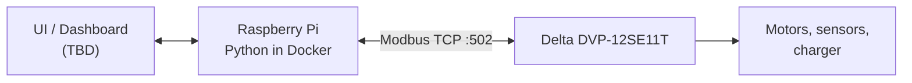

# Solar Panel Cleaning Robot — IoT Gateway

**[ภาษาไทย](#ภาษาไทย) | [English](#english)**

---

## ภาษาไทย

### เกี่ยวกับโปรเจกต์

โครงงานวิศวกรรมหุ่นยนต์ (ปริญญาตรี) มจพ.
**"Development of an IoT-Based Control, Monitoring, and Self-Charging System for a Solar Panel Cleaning Robot"**
(การพัฒนาระบบควบคุม ติดตาม และชาร์จพลังงานอัตโนมัติผ่าน IoT สำหรับหุ่นยนต์ทำความสะอาดแผงโซลาร์เซลล์)

หุ่นยนต์ถูกควบคุมด้วย PLC Delta DVP-12SE11T ส่วนนี้พัฒนาเสร็จแล้ว
Repository นี้คือ **IoT Gateway** บน Raspberry Pi ที่ทำหน้าที่อ่านสถานะและสั่งงาน PLC ผ่าน Modbus TCP

### ภาพรวมระบบ


- **PLC** รับผิดชอบ logic การเคลื่อนที่, interlock และความปลอดภัยทั้งหมด
- **Pi** ทำหน้าที่อ่านข้อมูลและส่ง "คำขอ" (request bit) เท่านั้น ladder ใน PLC เป็นตัวตัดสินใจว่าจะทำตามหรือไม่
- Pi คุยกับ PLC โดยตรงผ่าน Modbus TCP ไม่ใช้ MQTT

### ความสามารถ (เป้าหมาย)

- ควบคุม: Start / Stop / เลือก Mode
- ติดตาม: สถานะหุ่นยนต์, ตำแหน่ง/limit switch, alarm
- แบตเตอรี่และการชาร์จเอง: แรงดัน, กระแส, %, สถานะการชาร์จ
- ตั้งเวลาทำความสะอาด และบันทึกประวัติ

### ความคืบหน้า

| ขั้น | งาน | สถานะ |
|---|---|---|
| 1 | Config + tag map + แปลง address ของ Delta | เสร็จ |
| 2 | PLC จำลอง (Mock) | 2a–2b เสร็จ (datastore, TCP server), 2c กำลังทำ |
| 3 | Client อ่านค่า (read-only) | ยังไม่เริ่ม |
| 4 | Polling + logging | ยังไม่เริ่ม |
| 5 | คำสั่ง Start/Stop/Mode | ยังไม่เริ่ม |
| 6 | แบตเตอรี่ / การชาร์จ | ยังไม่เริ่ม |
| 7 | ตั้งเวลา | ยังไม่เริ่ม |
| 8 | UI / API | ยังไม่เริ่ม |

### โครงสร้างไฟล์

```
app/
  config.py        อ่านค่าตั้งค่าจาก .env
  delta.py         แปลงชื่อ device ของ Delta (X/Y/M/D) เป็น Modbus address
  tags.py          โหลดและตรวจสอบ tag map
  __main__.py      จุดเริ่มโปรแกรม (python -m app)
config/
  plc_tags.yaml    tag map: ชื่อ -> device ใน PLC
tests/             unit tests
.env.example       ตัวอย่างค่าตั้งค่า (คัดลอกเป็น .env)
Dockerfile, docker-compose.yml
```

### การตั้งค่า

ค่าคงที่ทั้งหมดอยู่นอกโค้ด:

| ไฟล์ | commit ขึ้น git | เก็บอะไร |
|---|---|---|
| `.env` | **ไม่** | IP/port/unit ID ของ PLC, API key, การตั้งค่า log |
| `.env.example` | ใช่ | ตัวอย่างทุก key (ค่าหลอก) |
| `config/plc_tags.yaml` | ใช่ | tag map ของ I/O |

```bash
cp .env.example .env    # แล้วแก้ค่าจริง
```

### Tag map

โค้ดอ้างถึง PLC ด้วย **ชื่อ tag** เท่านั้น ห้ามใช้ address ตรงๆ

```yaml
tags:
  start_cmd:
    device: M10       # device ใน ladder
    dir: write        # read | write | rw
    type: bool        # bool | int16 | uint16 | int32 | float32
    desc: "ขอเริ่มทำความสะอาด (pulse)"
  battery_v:
    device: D100
    dir: read
    type: int16
    scale: 0.1
    unit: V
```

กฎที่ระบบตรวจให้:
- X/Y อ่านได้อย่างเดียว เขียนไม่ได้
- M/X/Y ต้องเป็น `bool` ส่วน D ต้องเป็นตัวเลข
- address ห้ามซ้อนกัน (int32/float32 ใช้ 2 register)
- เขียนได้เฉพาะ tag ที่ `dir: write` หรือ `rw`

### การรันบน Raspberry Pi

ต้องใช้ Raspberry Pi 4/5 ที่ลง **OS แบบ 64-bit** และติดตั้ง Docker เท่านั้น

```bash
curl -fsSL https://get.docker.com | sh
sudo usermod -aG docker $USER          # จากนั้น logout/login

cp .env.example .env                   # ใส่ IP ของ PLC
docker compose up -d --build           # รัน
docker compose logs -f gateway         # ดู log
docker compose down                    # หยุด
```

### PLC จำลอง (Mock PLC)

Modbus TCP server ที่ทำตัวเหมือน DVP-12SE11T มีเฉพาะ address ใน `config/plc_tags.yaml` ถ้าอ่าน address อื่นจะได้ exception 02 เหมือน PLC จริง

```bash
# ผ่าน Docker: ตั้ง PLC_HOST=plc-sim ใน .env ก่อน
docker compose --profile sim up --build
# จากเครื่อง host ต่อได้ที่ localhost:5020 (เช่น Modbus Poll)

# รันตรงบนเครื่อง (ไม่ใช้ Docker): ตั้ง SIM_PORT=5020 ใน .env
.venv/bin/python -m app.sim
```

### การพัฒนา / ทดสอบ

ต้องมี `python3-venv` ก่อน (`sudo apt install python3.12-venv`) ถ้ามีแค่ `python3-pip` ให้ใช้วิธีที่สอง

```bash
# วิธีปกติ
python3 -m venv .venv
.venv/bin/pip install -r requirements.txt -r requirements-dev.txt

# ไม่มี python3-venv: ใช้ pip ของระบบติดตั้งลง venv
python3 -m venv --without-pip .venv
pip3 --python .venv/bin/python install -r requirements.txt -r requirements-dev.txt

.venv/bin/python -m pytest
```

### ความปลอดภัย

- คำสั่งไป PLC เป็นหุ่นยนต์ที่ขยับได้จริง โค้ดทดสอบควรเป็น read-only เป็นค่าเริ่มต้น
- ถ้าการเชื่อมต่อหลุด หุ่นยนต์ต้องไม่อยู่ในสภาวะอันตราย (แนะนำให้มี watchdog/heartbeat ฝั่ง PLC)
- ห้าม commit `.env` หรือรหัสผ่านจริง

---

## English

### About

Bachelor's senior project, Robotics Engineering, KMUTNB:
**"Development of an IoT-Based Control, Monitoring, and Self-Charging System for a Solar Panel Cleaning Robot"**

The robot is controlled by a Delta DVP-12SE11T PLC; that part is finished.
This repository is the **IoT Gateway** running on a Raspberry Pi, which reads status from and sends commands to the PLC over Modbus TCP.

### System Overview



- The **PLC** owns all motion logic, interlocks, and safety.
- The **Pi** only reads data and sends *requests* (request bits); the ladder logic decides whether to act.
- The Pi talks to the PLC directly over Modbus TCP — no MQTT.

### Features (target)

- Control: Start / Stop / Mode select
- Monitoring: robot state, position/limit switches, alarms
- Battery & self-charging: voltage, current, %, charging state
- Cleaning schedule and history logging

### Progress

| Step | Task | Status |
|---|---|---|
| 1 | Config + tag map + Delta address conversion | Done |
| 2 | Mock PLC | 2a–2b done (datastore, TCP server), 2c in progress |
| 3 | Read client (read-only) | Not started |
| 4 | Polling + logging | Not started |
| 5 | Start/Stop/Mode commands | Not started |
| 6 | Battery / charging | Not started |
| 7 | Schedule | Not started |
| 8 | UI / API | Not started |

### Project Structure

```
app/
  config.py        settings loaded from .env
  delta.py         Delta device (X/Y/M/D) -> Modbus address conversion
  tags.py          tag map loader + validation
  __main__.py      entry point (python -m app)
config/
  plc_tags.yaml    tag map: name -> PLC device
tests/             unit tests
.env.example       sample settings (copy to .env)
Dockerfile, docker-compose.yml
```

### Configuration

No fixed parameter lives in code:

| File | Committed | Holds |
|---|---|---|
| `.env` | **No** | PLC IP/port/unit ID, API keys, log settings |
| `.env.example` | Yes | Every key with a dummy value |
| `config/plc_tags.yaml` | Yes | I/O tag map |

```bash
cp .env.example .env    # then fill in real values
```

### Tag Map

Code refers to the PLC by **tag name** only, never by raw address.

```yaml
tags:
  start_cmd:
    device: M10       # device in the ladder
    dir: write        # read | write | rw
    type: bool        # bool | int16 | uint16 | int32 | float32
    desc: "Request cleaning start (pulse)"
  battery_v:
    device: D100
    dir: read
    type: int16
    scale: 0.1
    unit: V
```

Enforced rules:
- X/Y are read-only.
- M/X/Y must be `bool`; D must be numeric.
- Addresses must not overlap (int32/float32 use 2 registers).
- Only `dir: write` or `rw` tags can be written.

### Running on the Raspberry Pi

Requires a Raspberry Pi 4/5 with a **64-bit OS** and Docker — nothing else on the host.

```bash
curl -fsSL https://get.docker.com | sh
sudo usermod -aG docker $USER          # then log out / in

cp .env.example .env                   # set the PLC IP
docker compose up -d --build           # run
docker compose logs -f gateway         # follow logs
docker compose down                    # stop
```

### Mock PLC

A Modbus TCP server that behaves like the DVP-12SE11T. Only addresses in `config/plc_tags.yaml` exist; any other address returns exception 02, like the real PLC.

```bash
# With Docker: set PLC_HOST=plc-sim in .env first
docker compose --profile sim up --build
# From the host, connect to localhost:5020 (e.g. Modbus Poll)

# Directly on the machine (no Docker): set SIM_PORT=5020 in .env
.venv/bin/python -m app.sim
```

### Development / Tests

Needs `python3-venv` (`sudo apt install python3.12-venv`). With only `python3-pip`, use the second form.

```bash
# Normal
python3 -m venv .venv
.venv/bin/pip install -r requirements.txt -r requirements-dev.txt

# No python3-venv: install into the venv with the system pip
python3 -m venv --without-pip .venv
pip3 --python .venv/bin/python install -r requirements.txt -r requirements-dev.txt

.venv/bin/python -m pytest
```

### Safety

- Commands to the PLC move real hardware; test code should be read-only by default.
- A lost connection must never leave the robot in an unsafe state (a PLC-side watchdog/heartbeat is recommended).
- Never commit `.env` or real credentials.
