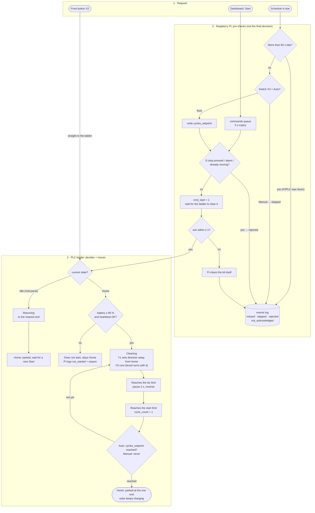
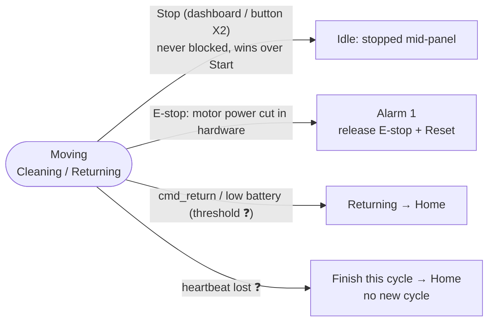

# Operation Flowchart

- [ภาษาไทย](#ภาษาไทย)
- [English](#english)

---

## ภาษาไทย

### 1 รอบทำความสะอาด

ตั้งแต่สั่ง Start จนหุ่นกลับจุดพัก. แบ่ง 3 ช่วงตามว่า **ใครตัดสิน**: ผู้สั่ง → Pi ตรวจก่อนส่ง → ladder ใน PLC ตัดสินและสั่งมอเตอร์.
State ทั้งหมดดู `docs/robot-operation.md` §4. ค่าที่มี ❓ ยังไม่ยืนยันกับ ladder จริง (ตอนนี้อ้างตาม mock `app/sim/ladder.py`).

**อ่านแผนภาพ:** ถ้า Pi ปฏิเสธ จะบันทึกเหตุผลลง `events` ไว้ให้ dashboard แสดง. แต่ถ้า Pi ส่งคำสั่งผ่านไปแล้ว ladder ยังตัดสินเองเสมอว่าจะออกเดินหรือไม่ (แบต ≥ เกณฑ์ใน PLC, heartbeat). เกณฑ์ตาม spec คือ 80 % แต่ตอนเทสตั้งใน PLC เป็น 40 % ส่วน pre-check ฝั่ง Pi ยังใช้ 80 % ดู [open-decisions.md](open-decisions.md) ข้อ 2. ปุ่มหน้าเครื่องเข้า ladder ตรง ไม่ผ่าน Pi.

### เหตุแทรกระหว่างเดิน (Cleaning / Returning)

แยกจากแผนภาพบน เพราะเกิดได้ทุกจุดของรอบ ถ้าวาดรวมจะมีเส้นจากทุกกล่อง.

- Stop, cmd_return และแบตต่ำ ใช้ได้กับ Cleaning. ตอน Returning ใช้ได้แค่ Stop กับ E-stop.
- E-stop ไม่ต้องรอ PLC หรือ Pi: สายตัดไฟเข้า MD30C ตรง. X4 แค่รายงานสถานะให้ ladder เข้า Alarm.

---

## English

### One Cleaning Run

From a Start request until the robot is back at a parking end. Split into 3 parts by **who decides**: requester → Pi pre-checks → the PLC ladder decides and drives the motor.
For all states see `docs/robot-operation.md` §4. Items marked ❓ are not yet confirmed against the real ladder (they currently follow the mock `app/sim/ladder.py`).

**Reading the diagram:** When the Pi refuses, it logs the reason in `events` for the dashboard to show. Once the Pi has sent the command, the ladder still decides on its own whether to move (battery ≥ the PLC threshold, heartbeat). The spec says 80 %; for testing the PLC is set to 40 %, while the Pi pre-check still uses 80 %; see [open-decisions.md](open-decisions.md) item 2. The front button goes straight to the ladder, not through the Pi.

### Interrupts While Moving (Cleaning / Returning)

Kept out of the chart above because they can happen at any point of the run; drawing them there would add an edge from every box.

- Stop, cmd_return and low battery apply while Cleaning. While Returning, only Stop and E-stop apply.
- E-stop does not wait for the PLC or the Pi: its contact cuts the MD30C supply directly. X4 only reports the status so the ladder enters Alarm.
