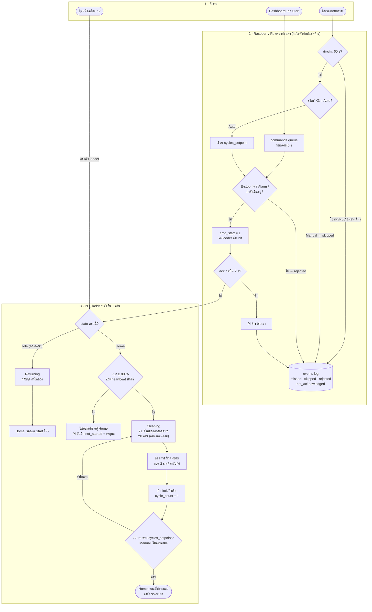
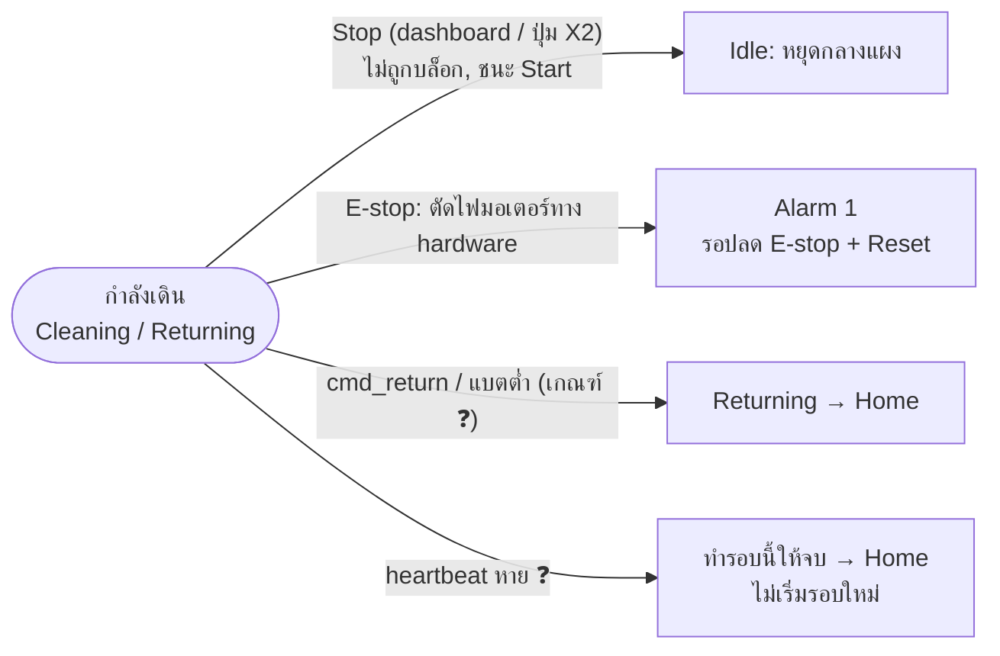

# Flowchart การทำงาน (1 รอบทำความสะอาด)

ตั้งแต่สั่ง Start จนหุ่นกลับจุดพัก. แบ่ง 3 ช่วงตามว่า **ใครตัดสิน**: ผู้สั่ง → Pi ตรวจก่อนส่ง → ladder ใน PLC ตัดสินและสั่งมอเตอร์.
State ทั้งหมดดู `docs/robot-operation.md` §4. ค่าที่มี ❓ ยังไม่ยืนยันกับ ladder จริง (ตอนนี้อ้างตาม mock `app/sim/ladder.py`).

**อ่านแผนภาพ:** ถ้า Pi ปฏิเสธ จะบันทึกเหตุผลลง `events` ไว้ให้ dashboard แสดง. แต่ถ้า Pi ส่งคำสั่งผ่านไปแล้ว ladder ยังตัดสินเองเสมอว่าจะออกเดินหรือไม่ (แบต ≥ 80 %, heartbeat). ปุ่มหน้าเครื่องเข้า ladder ตรง ไม่ผ่าน Pi.

## เหตุแทรกระหว่างเดิน (Cleaning / Returning)

แยกจากแผนภาพบน เพราะเกิดได้ทุกจุดของรอบ ถ้าวาดรวมจะมีเส้นจากทุกกล่อง.

- Stop, cmd_return และแบตต่ำ ใช้ได้กับ Cleaning. ตอน Returning ใช้ได้แค่ Stop กับ E-stop.
- E-stop ไม่ต้องรอ PLC หรือ Pi: สายตัดไฟเข้า MD30C ตรง. X4 แค่รายงานสถานะให้ ladder เข้า Alarm.
