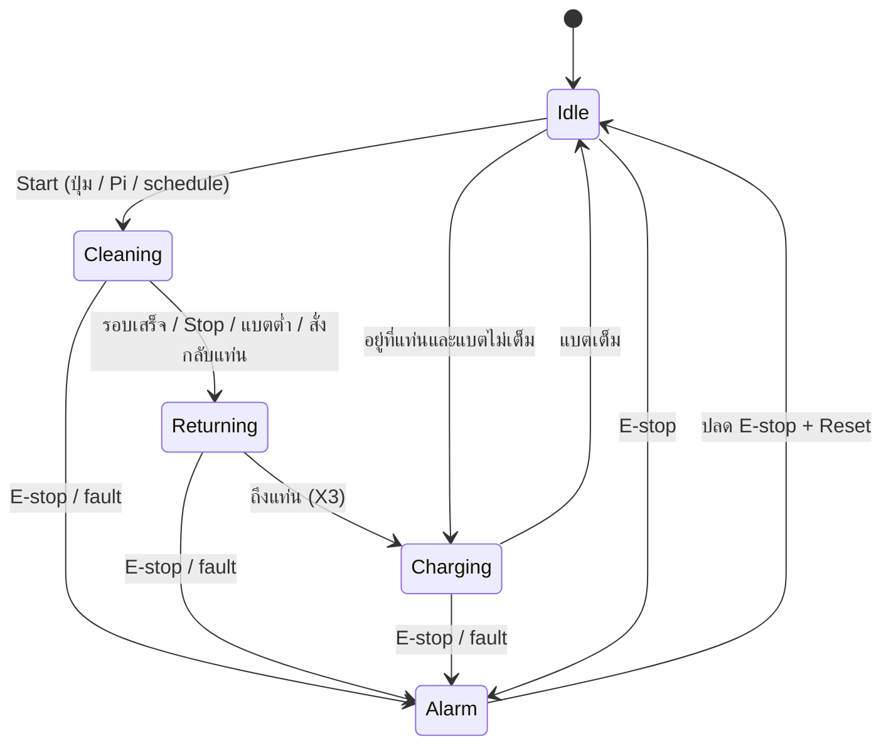

# การทำงานของหุ่นยนต์ทำความสะอาดแผงโซลาร์ (Robot Operation Spec)

> **สถานะเอกสาร: ร่าง (DRAFT)** — เขียนจากสมมติฐาน ให้เจ้าของโปรเจกต์ตรวจแก้
>
> - ❓ = สมมติฐาน ยังไม่ยืนยัน → แก้ให้ตรงของจริง หรือลบทิ้ง
> - ✅ = ยืนยันแล้ว (จากเอกสาร/ข้อมูลที่มี)
> - ช่อง `____` = ต้องเติม
>
> เอกสารนี้เป็นแหล่งอ้างอิงสำหรับ: tag map (`config/plc_tags.yaml`), Mock PLC (Step 2c) และ dashboard

---

## 1. ภาพรวม

| หัวข้อ | รายละเอียด |
|---|---|
| หน้าที่ | ทำความสะอาดผิวแผงโซลาร์ แล้วมีจุดพัก 2 จุด ซ้ายสุดขวาสุดของแผงที่ต้องล้าง ซึ่งแล้วแต่ขนาดของแผง |
| ตัวควบคุม | ✅ PLC Delta DVP-12SE11T (X0–X7 input, Y0–Y3 transistor NPN output) |
| IoT | ✅ Raspberry Pi อ่าน/สั่ง PLC ผ่าน Modbus TCP |
| ลักษณะการเดิน | ✅ เดินตามแนวยาวของแถวแผง (ไป-กลับ) บนล้อ/รางที่ขอบเฟรมแผง |
| การทำความสะอาด | ✅ แปรงหมุน (brush) ปัดฝุ่นใช้น้ำ |
| การชาร์จ | ✅ ชาร์จเองตลอดเวลาเพราะมี solarcell ของตัวเอง |
| ความยาวแถวแผง | depend on customer |
| ความเร็วเดิน | ยังไม่ต้องคุมเพราะ PLC สั่งแค่เดินหรือหยุด motor |

---

## 2. Hardware

### 2.1 ต้นกำลัง (Actuators)

| อุปกรณ์ | ขับด้วย | ควบคุมจาก PLC | หมายเหตุ |
|---|---|---|---|
| มอเตอร์ขับเคลื่อน (drive) |  DC motor + Cytron MD30C driver |  Y0 = PWM, Y1 = DIR | ใช้ Module PC817 แปลงสัญญานคุยกับ Driver |
| มอเตอร์แปรง (brush) | ใช้กลไกและ gear ช่วยทดจาก motor ขับ | No | |
| วงจรชาร์จ | Tuya MPPT Solar Controller | No | ทำหน้าที่แค่คุม Solarcell และชาร์จเข้า Battery, MPPT มี api |
| Power usage | Battery | No | ไฟทั้งระบบใช้จาก Battery เท่านั้น |

### 2.2 Sensor

| Sensor | ชนิด | ต่อเข้า | ใช้ทำอะไร |
|---|---|---|---|
| Limit ต้นทาง (ฝั่งแท่น) | ✅ limit switch | ✅ X0 | รู้ว่าถึงปลายแถวฝั่งแท่น |
| Limit ปลายทาง | ✅ limit switch | ✅ X1 | รู้ว่าถึงปลายแถวอีกฝั่ง |
| ปุ่ม Start/Stop หน้าเครื่อง | ✅ push button | ✅ X2 | สั่งงานแบบ manual |
| ปุ่ม Mode หน้าเครื่อง | ✅ Manual/Auto Button | ✅ X3 | เลือกโหมด(ยังไม่ได้ติดตั้ง) |
| ปุ่มหยุดฉุกเฉิน (E-stop) | ✅ NC switch | ✅ X4 | ตัดการทำงาน |
| Temperature Sensor | (unplaned) | (unplaned) | วัดอุณภูมิ |
| Pzem Sensor |✅ Ampmeter | ✅ RS485 | วัดกระแส/Power |

### 2.3 แบตเตอรี่

| หัวข้อ | ค่า |
|---|---|
| ชนิด |  Li-ion |
| แรงดัน nominal | 48 V |
| แรงดันเต็ม / ต่ำสุด | ____ V / ____ V |
| ความจุ | 10.2 Ah |
| เกณฑ์แบตต่ำ (ให้กลับแท่นซ้ายขวา) |  20-30 % |
| เกณฑ์แบตเตอรี่ขั้นตํ่าก่อนออกไปทำงาน |  80 % |
| เกณฑ์ชาร์จเต็ม |  100 % |

---

## 3. Mode การทำงาน

| Mode | การทำงาน |
|---|---|
| Manual |  สั่ง start/stop เอง (ปุ่มหน้าเครื่อง หรือจาก dashboard) ทำจนกว่าจะกดหยุด |
| Auto | เริ่มเองตามเวลาที่ตั้ง (schedule จาก Pi) เช่น ทุกวัน 06:00 |

 Mode เลือกที่ไหน: สวิตช์หน้าเครื่อง

---

## 4. สถานะ (State) และการเปลี่ยนสถานะ

| # | State | การทำงาน | มอเตอร์เดิน | แปรง | ชาร์จ |
|---|---|---|---|---|---|
| 0 | Idle | จอดรอคำสั่ง (ปกติอยู่ที่แท่น) | หยุด | หยุด | เปิด |
| 1 | Cleaning | เดินไป-กลับบนแผง ปัดฝุ่น | ทำงาน | ทำงาน | เปิด |
| 2 | Returning | เดินกลับไปแท่น | ทำงาน (ทิศไปแท่น) |  ทำงาน | เปิด |
| 3 | Home | อยู่ที่แท่น/พัก/ชาร์จแบต | หยุด | หยุด | เปิด |
| 4 | Alarm | หยุดทุกอย่าง รอ reset | หยุด | หยุด | เปิด |

 กด Stop ระหว่าง Cleaning: **หยุดอยู่กับที่ (→ Idle)** (เวลาเปิดใหม่จะกลับแท่นที่ใกล้ที่สุดก่อน)

---

## 5. วิธีการเดิน (1 รอบการทำความสะอาด)

 ร่างลำดับ — แก้ให้ตรงกับ ladder:

1. เริ่มจากแท่น (X2 ต้นทาง = ON, X3 Mode = ON(Auto))
2. สั่ง PWM (Y0) แล้วเดินหน้า (Y1) ออกจากแท่นตามรอบที่ Pi สั่ง
3. เดินจนเจอ limit ปลายทาง (X1) → หยุด 2 วินาที
4. ถอยหลัง (Y1) กลับมาทางแท่น พร้อมแปรงหมุน
5. เจอ limit ต้นทาง (X1) → นับ 1 รอบ
6. ถ้ายังไม่ครบ n รอบ → กลับไปข้อ 2
7. ครบรอบ → เข้าแท่นจน Limit Switch สักฝั่ง ON

ระหว่างเดินถ้าแบตต่ำกว่าเกณฑ์ → ข้ามไปขั้น "กลับแท่น" ทันที
ยังไม่มี timeout (เดินนานเกิน ____ วินาทีแล้วไม่เจอ limit = ติดขัด → Alarm)

---

## 6. Alarm / Fault

| Code | สาเหตุ | ตรวจจาก | การจัดการ |
|---|---|---|---|
| 0 | ไม่มี | – | – |
| 1 | E-stop ถูกกด | X4 | หยุดทันที รอปลด + reset |
| 2 | แบตต่ำวิกฤต (ต่ำกว่า 20 %) | แรงดันแบต | พยายามกลับแท่น |
| 3 | เดินติด (timeout) | timer ใน ladder | หยุด |
| 4 | Limit ทั้งสองฝั่ง ON พร้อมกัน | X0 + X1 | sensor เสีย → หยุด |
| ____ | ____ | ____ | ____ |

---

## 7. ข้อมูลที่ Pi อ่าน / สั่ง (ร่าง tag map)

> ตำแหน่ง M/D ยังเป็น  ทั้งหมด → ต้องเอาจาก ladder จริง ✅

### 7.1 คำสั่ง (Pi → PLC)

| Tag | Device | ชนิด | ความหมาย |
|---|---|---|---|
| `cmd_start` | ❓ M100 | bool pulse | เริ่มทำความสะอาด |
| `cmd_stop` | ❓ M101 | bool pulse | หยุด |
| `cmd_return` | ❓ M102 | bool pulse | กลับแท่น |
| `cmd_reset_alarm` | ❓ M103 | bool pulse | reset alarm |
| `mode` | ❓ D100 | uint16 | 0 = manual, 1 = auto |
| `cycles_setpoint` | ❓ D101 | uint16 | จำนวนรอบต่อครั้ง |

❓ ladder **ล้าง bit คำสั่งเอง** หลังรับ (แนะนำ) หรือให้ Pi เขียน 0 ตามหลัง?

### 7.2 สถานะ (PLC → Pi)

| Tag | Device | ชนิด | ความหมาย |
|---|---|---|---|
| `robot_state` | ❓ D10 | uint16 | ตาม §4 (0–4) |
| `alarm_code` | ❓ D11 | uint16 | ตาม §6 |
| `cycle_count` | ❓ D12 | uint16 | รอบที่ทำไปแล้วในครั้งนี้ |
| `position_pct` | ❓ D13 | uint16 | ตำแหน่ง 0–100 % (ถ้ามี encoder) |
| `estop` | X4 | bool | |
| `limit_1` | X0 | bool | |
| `limit_2` | X1 | bool | |
| `start/stop` | X3 | bool | |
| `drive_fwd` / `drive_rev` | Y1 | bool | สถานะ output จริง |
| `speed` | Y0 | ____ | |
| `Power` | RS485 | ____ | พลังงานที่ระบบใช้ |

### 7.3 แบตเตอรี่/Solarcell

API From Tuya

---

## 8. คำถามที่ต้องตอบ (สรุป)

- [ ] หุ่นเดินแบบไหน (ล้อบนเฟรม / ราง / อื่นๆ) และความยาวแถว
- [ ] มอเตอร์ drive เป็น DC หรือ stepper, ควบคุมทิศยังไง
- [ ] I/O จริงของ X0–X7 และ Y0–Y3
- [ ] วัดแรงดัน/กระแสแบตยังไง (analog module ไหน หรือผ่าน Pi)
- [ ] ชนิดและแรงดันแบต
- [ ] แหล่งไฟที่ใช้ชาร์จ (self-charging มาจากไหน)
- [ ] กด Stop แล้วหยุดที่เดิม หรือกลับแท่น
- [ ] รายการ alarm จริงใน ladder
- [ ] ตำแหน่ง M/D ของคำสั่งและสถานะใน ladder
- [ ] ladder ล้าง bit คำสั่งเองไหม
