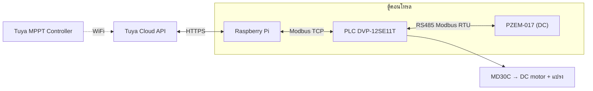
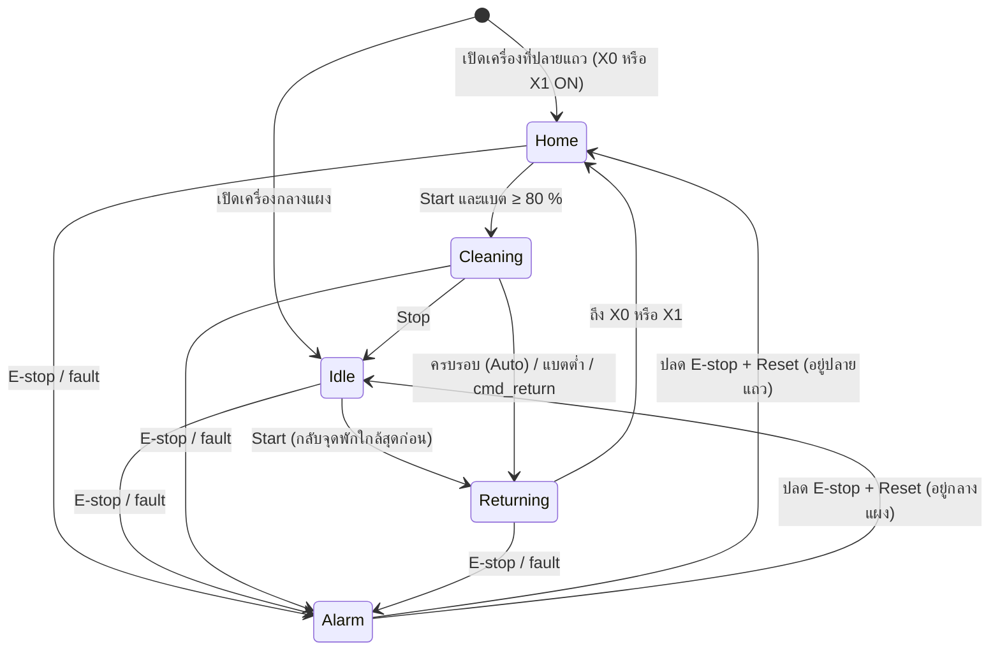

# การทำงานของหุ่นยนต์ทำความสะอาดแผงโซลาร์ (Robot Operation Spec)

> **สถานะเอกสาร: ร่างรอบ 2** — รวมคำตอบของเจ้าของโปรเจกต์แล้ว
>
> - ❓ = ยังไม่ยืนยัน → แก้ให้ตรงของจริง หรือลบทิ้ง
> - ✅ = ยืนยันแล้ว
> - ช่อง `____` = ต้องเติม
>
> เอกสารนี้เป็นแหล่งอ้างอิงสำหรับ: ladder, tag map (`config/plc_tags.yaml`), Mock PLC (Step 2c) และ dashboard

---

## 1. ภาพรวม

| หัวข้อ | รายละเอียด |
|---|---|
| หน้าที่ | ✅ ทำความสะอาดผิวแผงโซลาร์ เดินไป-กลับระหว่างจุดพัก 2 จุด (ซ้ายสุด / ขวาสุดของแถว) ระยะขึ้นกับขนาดแผงของลูกค้า |
| ตัวควบคุม | ✅ PLC Delta DVP-12SE11T (X0–X7 input, Y0–Y3 transistor NPN output) |
| IoT | ✅ Raspberry Pi — อ่าน/สั่ง PLC ผ่าน Modbus TCP และอ่านแบต/solar จาก Tuya Cloud API |
| Network | ✅ Router + AP ติดในตู้คอนโทรล (Pi, PLC อยู่ LAN เดียวกัน, ออก internet ได้) |
| ลักษณะการเดิน | ✅ เดินตามแนวยาวของแถวแผง (ไป-กลับ) บนล้อ/รางที่ขอบเฟรมแผง |
| การทำความสะอาด | ✅ แปรงหมุนปัดฝุ่น ทดเกียร์จากมอเตอร์ขับ (แปรงหมุนทุกครั้งที่เดิน) ใช้น้ำ — ระบบจ่ายน้ำเป็นงานอนาคต |
| การชาร์จ | ✅ ชาร์จตลอดเวลาจาก solar cell บนตัวหุ่น ผ่าน Tuya MPPT Solar Controller (ไม่มีแท่นชาร์จ) |
| ไฟเลี้ยงระบบ | ✅ ทั้งระบบใช้ไฟจาก Battery เท่านั้น |
| ความเร็วเดิน | ✅ ไม่คุมความเร็ว — PLC สั่งแค่เดิน/หยุด และทิศทาง |
| ตำแหน่ง | ✅ ไม่มี encoder รู้จริงแค่ปลายแถว 2 จุด (X0, X1) ส่วนตำแหน่งระหว่างทางประมาณจากเวลาเดินใน ladder |

### 1.1 Architecture

- ✅ Pi อ่านแบต % จาก Tuya แล้ว **เขียนลง PLC** (`battery_pct`) พร้อม heartbeat → ladder ตัดสินใจเรื่องแบตเอง
- ✅ PZEM ต่อกับ RS485 ของ PLC → PLC อ่านค่าเก็บใน D → Pi อ่านจาก PLC
- ⚠️ แบตเป็น 48 V **DC** → PZEM ต้องเป็นรุ่น DC (**PZEM-017** + shunt) ❓ ยืนยันรุ่น

---

## 2. Hardware

### 2.1 ต้นกำลัง (Actuators)

| อุปกรณ์ | ขับด้วย | ควบคุมจาก PLC | หมายเหตุ |
|---|---|---|---|
| มอเตอร์ขับเคลื่อน | ✅ DC motor + Cytron MD30C | ✅ Y0 = เดิน/หยุด (PWM), Y1 = ทิศทาง (DIR) | สัญญาณผ่าน PC817 opto-isolator |
| แปรง | ✅ ทดเกียร์จากมอเตอร์ขับ | – | หมุนเมื่อหุ่นเดิน |
| ระบบจ่ายน้ำ | (อนาคต) | ว่าง: Y2 / Y3 | |
| วงจรชาร์จ | ✅ Tuya MPPT Solar Controller | – | คุม solar → battery เอง, มี API ผ่าน Tuya Cloud |

### 2.2 Input / Sensor

| ขา | Sensor | ชนิด | ใช้ทำอะไร |
|---|---|---|---|
| X0 | ✅ Limit 1 (ปลายแถวฝั่งหนึ่ง) | limit switch | จุดพัก / กลับตัว |
| X1 | ✅ Limit 2 (ปลายแถวอีกฝั่ง) | limit switch | จุดพัก / กลับตัว |
| X2 | ✅ ปุ่ม Start/Stop หน้าเครื่อง | push button | สั่งงาน manual |
| X3 | ✅ สวิตช์ Mode (ยังไม่ติดตั้ง) | selector | Manual / Auto — ❓ ให้ **OFF = Auto** เพื่อให้ตอนยังไม่ติดตั้งเป็น Auto |
| X4 | ✅ E-stop (สถานะ) | NC contact | ปกติ = ON, กด = OFF |
| X5–X7 | ว่าง | | |
| RS485 | ✅ PZEM (ต่อกับ PLC) | Modbus RTU | แรงดัน/กระแส/กำลัง/พลังงาน |
| – | Temperature | (ยังไม่มีแผน) | |

### 2.3 E-stop ✅

- **ตัดไฟเฉพาะวงจรมอเตอร์** (ไฟเข้า MD30C) ทางฮาร์ดแวร์ → มอเตอร์หยุดแม้ PLC ค้าง
- PLC / Pi / Router **ยังมีไฟ** → รายงาน alarm ขึ้น dashboard ได้
- ต้องใช้ E-stop ที่มี **2 contact** (หรือผ่าน relay): contact 1 ตัดไฟมอเตอร์, contact 2 (NC) เข้า X4
- ❓ ปัจจุบันยังเป็นแบบตัดไฟทั้งวงจร → ต้องแก้สายไฟตามนี้

### 2.4 แบตเตอรี่

| หัวข้อ | ค่า |
|---|---|
| ชนิด | ✅ Li-ion |
| แรงดัน nominal | ✅ 48 V |
| ความจุ | ✅ 10.2 Ah |
| แรงดันเต็ม / ต่ำสุด | ไม่จำเป็นตอนนี้ — ใช้ % จาก Tuya ในการตัดสินใจ |
| เกณฑ์แบตต่ำ → กลับจุดพัก | ✅ 20–30 % ❓ เลือกค่าเดียวสำหรับ ladder: ____ % |
| เกณฑ์ขั้นต่ำก่อนออกทำงาน | ✅ 80 % |

---

## 3. Mode การทำงาน

| Mode | การทำงาน |
|---|---|
| Manual | ✅ สั่ง start/stop (ปุ่ม X2 หรือ dashboard) เดินไป-กลับ **ไม่จำกัดรอบ จนกว่าจะกดหยุด** |
| Auto | ✅ Pi ส่ง `cmd_start` ตามเวลาที่ตั้ง (schedule) → ทำ `cycles_setpoint` รอบ → กลับจุดพัก |

- ✅ เลือก Mode ที่สวิตช์หน้าเครื่อง (X3) เท่านั้น — Pi **อ่านได้อย่างเดียว**
- ✅ ตอนยังไม่ติดสวิตช์ = Auto
- ❓ Manual: แบตต่ำกว่าเกณฑ์ → ยังกลับจุดพักเอง (แนะนำ, กันแบตหมดกลางแผง) หรือเดินต่อจนกดหยุด?

---

## 4. สถานะ (State) และการเปลี่ยนสถานะ

| # | State | ความหมาย | มอเตอร์ (+แปรง) |
|---|---|---|---|
| 0 | Idle | หยุดกลางแผง (หลังกด Stop) | หยุด |
| 1 | Cleaning | เดินไป-กลับทำความสะอาด | เดิน |
| 2 | Returning | เดินกลับจุดพักที่ใกล้ที่สุด | เดิน |
| 3 | Home | จอดที่ปลายแถว (X0 หรือ X1) พัก/ชาร์จ | หยุด |
| 4 | Alarm | หยุดทุกอย่าง รอ reset | หยุด (ไฟมอเตอร์ถูกตัดถ้าเป็น E-stop) |

- ✅ ชาร์จ solar ตลอดทุก state ไม่มี state ชาร์จแยก
- ✅ "จุดพักใกล้สุด" หาจากเวลาเดินที่ ladder จับไว้ (B3)
- ❓ Start ตอน Home แต่แบต < 80 % → ไม่ออก + แจ้งเตือน (alarm หรือแค่ status?)

---

## 5. วิธีการเดิน (1 รอบการทำความสะอาด)

1. เริ่มที่จุดพัก (X0 **หรือ** X1 ON), แบต ≥ 80 %
2. ตั้งทิศ (Y1) ให้เดินออกจากจุดพักที่อยู่ แล้วเปิดมอเตอร์ (Y0) — แปรงหมุนตาม
3. เดินจนเจอ limit อีกฝั่ง → หยุด 2 วินาที
4. กลับทิศ (Y1) เดินกลับ
5. เจอ limit ฝั่งเริ่ม → นับ 1 รอบ
6. **Auto:** ยังไม่ครบ `cycles_setpoint` รอบ → กลับไปข้อ 2 / **Manual:** วนไปเรื่อยๆ จนกด Stop
7. ครบรอบ → หยุดที่จุดพัก (Home)

- ระหว่างเดินถ้าแบตต่ำกว่าเกณฑ์ → Returning ทันที
- ✅ ladder จับเวลาเดินจาก limit หนึ่งไปอีก limit → ใช้ประมาณตำแหน่ง/หาจุดพักใกล้สุด
- (อนาคต) timeout: เดินนานเกินเวลาเดินปกติ × ____ แล้วไม่เจอ limit → Alarm 3

---

## 6. Alarm / Fault

| Code | สาเหตุ | ตรวจจาก | การจัดการ |
|---|---|---|---|
| 0 | ไม่มี | – | – |
| 1 | E-stop ถูกกด | X4 = OFF | มอเตอร์ถูกตัดไฟทางฮาร์ดแวร์, รอปลด + reset |
| 2 | แบตต่ำวิกฤต (< 20 %) | `battery_pct` จาก Pi | กลับจุดพัก |
| 3 | เดินติด / timeout | timer ใน ladder | (อนาคต) |
| 4 | Limit ทั้งสองฝั่ง ON พร้อมกัน | X0 + X1 | sensor เสีย → หยุด |
| 5 | ❓ Pi heartbeat หาย (ไม่รู้ค่าแบต) | `pi_heartbeat` ไม่เปลี่ยนเกิน ____ วินาที | ❓ ทำรอบปัจจุบันให้จบแล้วกลับจุดพัก + ไม่เริ่มรอบใหม่ |
| 6 | ❓ อ่าน PZEM ไม่ได้ | RS485 timeout | แจ้งเตือนอย่างเดียว |

---

## 7. ข้อมูลที่ Pi อ่าน / เขียน (ร่าง tag map)

> ตำแหน่ง M/D เป็น ❓ ทั้งหมด → ใช้เป็นค่าสมมติใน Mock ก่อน แล้วเปลี่ยนตาม ladder จริง

### 7.1 Pi → PLC (เขียน)

| Tag | Device | ชนิด | ความหมาย |
|---|---|---|---|
| `cmd_start` | ❓ M100 | bool pulse | เริ่มทำงาน (ใช้ได้ทั้ง Manual/Auto) |
| `cmd_stop` | ❓ M101 | bool pulse | หยุดอยู่กับที่ |
| `cmd_return` | ❓ M102 | bool pulse | กลับจุดพัก |
| `cmd_reset_alarm` | ❓ M103 | bool pulse | reset alarm |
| `cycles_setpoint` | ❓ D101 | uint16 | จำนวนรอบในโหมด Auto |
| `battery_pct` | ❓ D110 | uint16 | แบต % จาก Tuya (Pi เขียนทุก ____ วินาที) |
| `pi_heartbeat` | ❓ D111 | uint16 | Pi เพิ่มค่า +1 ทุก ____ วินาที (ladder ใช้เป็น watchdog) |

❓ ladder **ล้าง bit คำสั่ง (M100–M103) เอง** หลังรับ (แนะนำ) หรือให้ Pi เขียน 0 ตามหลัง?

### 7.2 PLC → Pi (อ่าน)

| Tag | Device | ชนิด | ความหมาย |
|---|---|---|---|
| `robot_state` | ❓ D10 | uint16 | §4 (0–4) |
| `alarm_code` | ❓ D11 | uint16 | §6 |
| `cycle_count` | ❓ D12 | uint16 | รอบที่ทำไปแล้วในครั้งนี้ |
| `position_est_pct` | ❓ D13 | uint16 | ตำแหน่งประมาณจากเวลาเดิน 0–100 % (ถ้า ladder คำนวณให้) |
| `limit_1` | X0 | bool | |
| `limit_2` | X1 | bool | |
| `start_stop_btn` | X2 | bool | |
| `mode_switch` | X3 | bool | ❓ OFF = Auto, ON = Manual |
| `estop_ok` | X4 | bool | 1 = ปกติ, 0 = กด E-stop |
| `drive_run` | Y0 | bool | มอเตอร์เดิน |
| `drive_dir` | Y1 | bool | ❓ 1 = ไปทาง X1, 0 = ไปทาง X0 |

### 7.3 PZEM (ผ่าน PLC)

PLC อ่าน PZEM ทาง RS485 แล้วเก็บใน D. ❓ scale ตาม datasheet PZEM-017 (ต้องยืนยัน)

| Tag | Device | ชนิด | Scale | หน่วย |
|---|---|---|---|---|
| `pzem_voltage` | ❓ D20 | uint16 | 0.01 | V |
| `pzem_current` | ❓ D21 | uint16 | 0.01 | A |
| `pzem_power` | ❓ D22 | uint32 (2 word) | 0.1 | W |
| `pzem_energy` | ❓ D24 | uint32 (2 word) | 1 | Wh |

### 7.4 Tuya MPPT (Pi อ่านจาก Cloud — ไม่ผ่าน PLC)

| ข้อมูล | ใช้ทำอะไร |
|---|---|
| แบต % | แสดงผล + เขียนลง PLC (`battery_pct`) |
| ❓ แรงดันแบต, แรงดัน/กำลัง solar, สถานะชาร์จ | แสดงผลบน dashboard |

❓ ชื่อ field (DP code) ขึ้นกับรุ่น MPPT → ดูจาก Tuya IoT Platform

---

## 8. คำถามที่ยังค้าง

- [ ] เกณฑ์แบตต่ำค่าเดียวสำหรับ ladder (20–30 %)
- [ ] Manual + แบตต่ำ → กลับจุดพักเองไหม
- [ ] Start ตอนแบต < 80 % → alarm หรือแค่สถานะ
- [ ] Heartbeat: ความถี่ที่ Pi เขียน และ timeout ใน ladder
- [ ] ladder ล้าง bit คำสั่งเองไหม
- [ ] ทิศ Y1: 1 = ไปทางไหน
- [ ] X3: OFF = Auto ใช่ไหม
- [ ] รุ่น PZEM (017?) และ scale
- [ ] DP code ของ Tuya MPPT
- [ ] แก้สาย E-stop ให้ตัดแค่ไฟมอเตอร์
- [ ] ตำแหน่ง M/D จริงใน ladder
