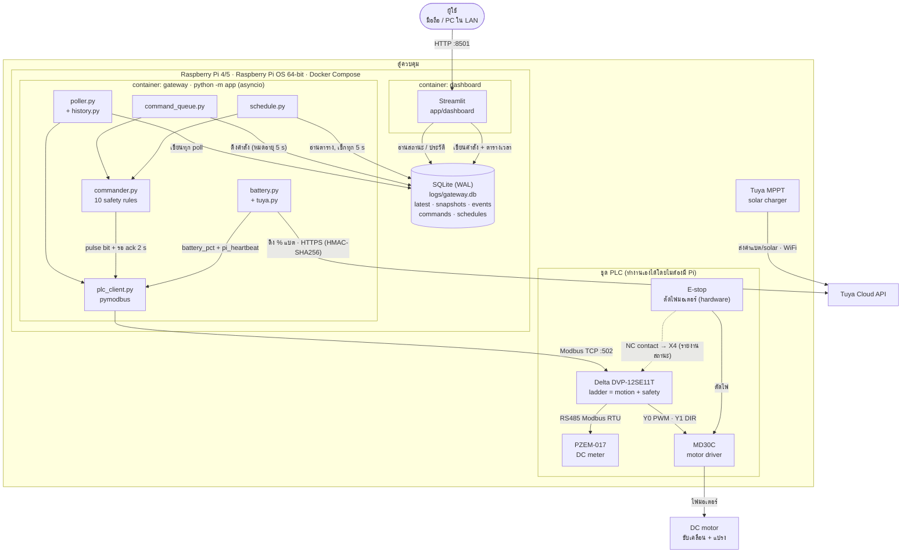

# Tech Stack (ภาพรวม)

## แผนภาพระบบ

**อ่านแผนภาพ:** Dashboard ไม่คุย Modbus เอง ทุกอย่างผ่าน SQLite. มีแค่ container `gateway` ที่ต่อ PLC และคำสั่งทุกตัวต้องผ่าน `commander.py` ก่อนถึง PLC. ส่วน ladder ใน PLC ตัดสินเรื่องการเคลื่อนที่และความปลอดภัยทั้งหมด. Pi แค่ขอคำสั่งกับส่งค่าแบตให้. ค่าแบตมาจาก Tuya MPPT ในตู้ ส่งขึ้น Tuya Cloud ทาง WiFi แล้ว Pi ดึงจาก cloud อีกที (Pi ไม่ต่อ MPPT ตรง).

## Stack แยกตามชั้น

| ชั้น | เทคโนโลยี | หน้าที่ |
|---|---|---|
| Hardware control | Delta DVP-12SE11T, ladder logic | motion, interlock, safety, ตัดสินใจกลับบ้านเมื่อแบตต่ำ |
| Field bus | RS485 Modbus RTU | PLC ↔ PZEM-017 (V, A, W) |
| Plant link | Ethernet, Modbus TCP (PLC = server :502) | Pi ↔ PLC |
| Gateway runtime | Python 3.12, asyncio | poll, คำสั่ง, ส่งค่าแบต + heartbeat, ตารางเวลา |
| Library | `pymodbus` 3.x, `pydantic-settings`, `PyYAML`, `tzdata` | Modbus, config `.env`, tag map, timezone |
| Storage | SQLite (WAL) `logs/gateway.db` | สถานะล่าสุด, ประวัติ, events, คิวคำสั่ง, ตารางเวลา |
| UI | Streamlit (`requirements-dashboard.txt`) :8501 | ดูสถานะ, ส่งคำสั่ง, ตั้งเวลา, กราฟ (step 8: ยังเทียบเวอร์ชันกับเพื่อนในทีม) |
| Cloud | Tuya Cloud API (HTTPS, stdlib client) | % แบต, ข้อมูล solar จาก MPPT |
| Deploy | Docker + Compose, image `linux/arm64`, `python:3.12-slim` | `gateway`, `dashboard`; `plc-sim` สำหรับทดสอบ |
| Config | `.env` (secrets, ไม่ commit), `config/plc_tags.yaml` | ไม่มี IP/address/key ใน code |
| Test | mock PLC `app/sim` (pymodbus server + ladder จำลอง) | ทดสอบได้โดยไม่มี PLC จริง |
