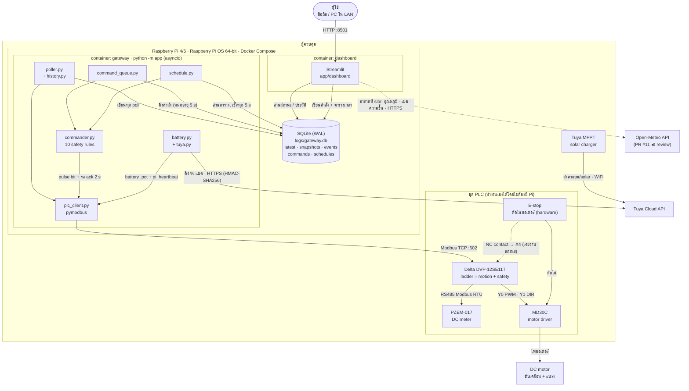
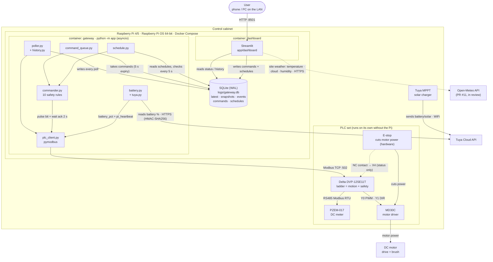

# Tech Stack

- [ภาษาไทย](#ภาษาไทย)
- [English](#english)

---

## ภาษาไทย

### แผนภาพระบบ

**อ่านแผนภาพ:** Dashboard ไม่คุย Modbus เอง ทุกอย่างผ่าน SQLite. มีแค่ container `gateway` ที่ต่อ PLC และคำสั่งทุกตัวต้องผ่าน `commander.py` ก่อนถึง PLC. ส่วน ladder ใน PLC ตัดสินเรื่องการเคลื่อนที่และความปลอดภัยทั้งหมด. Pi แค่ขอคำสั่งกับส่งค่าแบตให้. ค่าแบตมาจาก Tuya MPPT ในตู้ ส่งขึ้น Tuya Cloud ทาง WiFi แล้ว Pi ดึงจาก cloud อีกที (Pi ไม่ต่อ MPPT ตรง).

**⚠️ ข้อมูลจากการเทส (2026-10-01):** MPPT รุ่นนี้ตอบ `[]` จาก API `iot-03 .../status` ที่ `tuya.py` ใช้อยู่ ต้องอ่านจาก `v2.0 .../shadow/properties` และ **ไม่มี DP ที่เป็น % แบต** (มีแรงดันใน raw DP) ยังไม่ได้เลือกวิธีแก้ ดู [open-decisions.md](open-decisions.md) ข้อ 1. ระหว่างนี้เทสกับ PLC จริงด้วย `BATTERY_FAKE_PCT` บน branch `test/fake-tuya-battery` (ห้าม merge).

**อากาศ (Open-Meteo):** dashboard ดึงเองโดยตรง (เส้นประ) ไว้ดูว่าการชาร์จโซลาร์แปรผันตามอากาศ gateway และ PLC ไม่ได้ใช้ค่านี้.

### Stack แยกตามชั้น

| ชั้น | เทคโนโลยี | หน้าที่ |
|---|---|---|
| Hardware control | Delta DVP-12SE11T, ladder logic | motion, interlock, safety, ตัดสินใจกลับบ้านเมื่อแบตต่ำ |
| Field bus | RS485 Modbus RTU | PLC ↔ PZEM-017 (V, A, W) |
| Plant link | Ethernet, Modbus TCP (PLC = server :502) | Pi ↔ PLC |
| Gateway runtime | Python 3.12, asyncio | poll, คำสั่ง, ส่งค่าแบต + heartbeat, ตารางเวลา |
| Library | `pymodbus` 3.x, `pydantic-settings`, `PyYAML`, `tzdata` | Modbus, config `.env`, tag map, timezone |
| Storage | SQLite (WAL) `logs/gateway.db` | สถานะล่าสุด, ประวัติ, events, คิวคำสั่ง, ตารางเวลา |
| UI | Streamlit (`requirements-dashboard.txt`) :8501 | ดูสถานะ, ส่งคำสั่ง, ตั้งเวลา, กราฟ (step 8: merge เข้า main แล้ว, PR #9) |
| Cloud | Tuya Cloud API (HTTPS, stdlib client) | % แบต, ข้อมูล solar จาก MPPT (⚠️ ไม่มี DP % แบต ดู open-decisions) |
| Weather | Open-Meteo API (HTTPS, ไม่ต้องใช้ key, stdlib) | อุณหภูมิ, เมฆ, ความชื้นที่ site ใน dashboard (PR #11 รอ review) |
| Deploy | Docker + Compose, image `linux/arm64`, `python:3.12-slim` | `gateway`, `dashboard`; `plc-sim` สำหรับทดสอบ |
| Config | `.env` (secrets, ไม่ commit), `config/plc_tags.yaml` | ไม่มี IP/address/key ใน code |
| Test | mock PLC `app/sim` (pymodbus server + ladder จำลอง) | ทดสอบได้โดยไม่มี PLC จริง |

---

## English

### System Diagram

**Reading the diagram:** The dashboard never talks Modbus; everything goes through SQLite. Only the `gateway` container connects to the PLC, and every command passes through `commander.py` first. The ladder in the PLC decides all motion and safety; the Pi only requests commands and feeds the battery value. The battery value comes from the Tuya MPPT in the cabinet, which reports to Tuya Cloud over WiFi; the Pi reads it from the cloud (no direct Pi ↔ MPPT link).

**⚠️ Test findings (2026-10-01):** this MPPT returns `[]` from the `iot-03 .../status` API that `tuya.py` uses; its data is only in `v2.0 .../shadow/properties`, and **there is no battery % DP** (only voltage inside a raw DP). Fix not chosen yet: see [open-decisions.md](open-decisions.md) item 1. Meanwhile, real-PLC bench tests use `BATTERY_FAKE_PCT` on branch `test/fake-tuya-battery` (never merged).

**Weather (Open-Meteo):** fetched by the dashboard directly (dashed line) to show how solar charging follows the weather; the gateway and the PLC do not use it.

### Stack by Layer

| Layer | Technology | Role |
|---|---|---|
| Hardware control | Delta DVP-12SE11T, ladder logic | motion, interlocks, safety, return home on low battery |
| Field bus | RS485 Modbus RTU | PLC ↔ PZEM-017 (V, A, W) |
| Plant link | Ethernet, Modbus TCP (PLC = server :502) | Pi ↔ PLC |
| Gateway runtime | Python 3.12, asyncio | polling, commands, battery feed + heartbeat, schedule |
| Libraries | `pymodbus` 3.x, `pydantic-settings`, `PyYAML`, `tzdata` | Modbus, `.env` config, tag map, time zone |
| Storage | SQLite (WAL) `logs/gateway.db` | live status, history, events, command queue, schedules |
| UI | Streamlit (`requirements-dashboard.txt`) :8501 | status, commands, schedules, charts (step 8: merged into main, PR #9) |
| Cloud | Tuya Cloud API (HTTPS, stdlib client) | battery %, solar data from the MPPT (⚠️ no battery % DP, see open-decisions) |
| Weather | Open-Meteo API (HTTPS, no key, stdlib) | site temperature, cloud cover, humidity in the dashboard (PR #11, in review) |
| Deploy | Docker + Compose, `linux/arm64` image, `python:3.12-slim` | `gateway`, `dashboard`; `plc-sim` for testing |
| Config | `.env` (secrets, not committed), `config/plc_tags.yaml` | no IPs/addresses/keys in code |
| Test | mock PLC `app/sim` (pymodbus server + simulated ladder) | test without the real PLC |
